# Markdown Editor / Viewer Test Document

This file exercises a wide range of Markdown features. If everything renders correctly, your editor is in good shape.

---

## 1. Headings

# H1 — Largest heading

## H2

### H3

#### H4

##### H5

###### H6 — Smallest heading

Alternate (Setext) syntax:

# Setext H1

## Setext H2

---

## 2. Text formatting

**Bold text**, *italic text*, ***bold italic***, ~~strikethrough~~, and `inline code`.

Subscript: H~2~O    Superscript: E = mc^2^

==Highlighted text== (supported in some flavors)

A hard line break\
ends this line. (two trailing spaces above)

Backslash line break:\
also ends a line.

Escaped characters: \*not italic\*, \`not code\`, \\backslash, # not a heading.

Nested emphasis: **bold with *italic* inside**, *italic with **bold** inside*, and ***all three*** together.

---

## 3. Blockquotes

> Single-level blockquote.
>
> > Nested blockquote — second level.
> >
> > > Third level, with **formatting** and `code`.

Blockquote with multiple block types:

> **Heading-like lead-in**
>
> A paragraph inside a quote.
>
> - A list
> - inside a quote
>
> ```js
> // even a code block
> console.log("nested");
> ```

---

## 4. Lists

### Unordered

- Apple
- Banana
  - Cavendish
  - Plantain
    - Green
    - Ripe
- Cherry

### Ordered

1. First
2. Second
   1. Nested A
   2. Nested B
3. Third

### Task list

- [x] Write the test file

- [x] Include LaTeX

- [ ] Verify rendering in editor

- [ ] Ship it

### Nested task list

- [ ] Release checklist

  - [x] Bump version

  - [x] Update CHANGELOG

  - [ ] Tag release

    - [ ] Sign build

    - [ ] Upload artifacts

  - [ ] Announce

### Definition list

Markdown : A lightweight markup language with plain-text formatting syntax.

LaTeX : A typesetting system widely used for technical and scientific documents.

---

## 5. Links and references

Inline link: [Yeogi](https://www.yeogi.com)

Autolink: <https://yeogi.com>

Reference link: [CommonMark spec](https://spec.commonmark.org/ "CommonMark Specification")

Link with title: [hover me](https://yeogi.com "Tooltip text")

Email: [hello@yeogi.com](mailto:hello@yeogi.com)

### Wiki-style links (Obsidian/Logseq)

- Basic: [[Internal Note]]
- With alias: [[Internal Note|display text]]
- Section link: [[Internal Note#Heading]]
- Section with alias: [[Internal Note#Heading|see this part]]

Footnote reference[^1^](#fn-1) and another[^longnote^](#fn-longnote).

---

## 6. Images

Standard image:


Reference-style:


Sized via HTML:


---

## 7. Code

Inline: Use `git commit -m "message"` to commit.

Fenced code block with language:

```python
def fibonacci(n: int) -> list[int]:
    """Return the first n Fibonacci numbers."""
    seq = [0, 1]
    for _ in range(n - 2):
        seq.append(seq[-1] + seq[-2])
    return seq[:n]

print(fibonacci(10))
```

```typescript
interface User {
  id: number;
  name: string;
  email?: string;
}

const greet = (u: User): string => `Hello, ${u.name}!`;
```

```rust
fn main() {
    let greeting = "Hello, Yeogi!";
    for ch in greeting.chars() {
        print!("{ch}");
    }
    println!();
}
```

```sql
SELECT region, COUNT(*) AS bookings
FROM reservations
WHERE created_at >= '2026-01-01'
GROUP BY region
ORDER BY bookings DESC;
```

```bash
#!/usr/bin/env bash
for f in *.md; do
  echo "Processing $f"
done
```

```diff
--- a/src/app.ts
+++ b/src/app.ts
@@ -1,3 +1,4 @@
-const hello = "world";
+const hello = "Yeogi";
+const version = "0.4.2";
 export { hello };
```

Indented code block (4 spaces):

```
plain preformatted text
no syntax highlighting
preserves   whitespace
```

---

## 8. Tables

Basic table:

| Name | Role | Active |
| --- | --- | --- |
| Alice | Engineer | ✅ |
| Bob | Designer | ❌ |
| Charlie | PM | ✅ |

Alignment:

| Left-aligned | Center-aligned | Right-aligned |
| :--- | :---: | ---: |
| text | text | $1.00 |
| more text | more text | $25.50 |
| long content | centered | $1,234.56 |

Table with formatting:

| Feature | Status | Notes |
| --- | --- | --- |
| **Bold** | `stable` | Works everywhere |
| *Italic* | `stable` | Works everywhere |
| ~~Strike~~ | `GFM` | Requires GitHub Flavored MD |
|  | `extension` | Needs KaTeX/MathJax |
| Mermaid | `extension` | Needs Mermaid plugin |

Cells with line breaks (via `<br>`):

| Item | Notes |
| --- | --- |
| Multi-line | First line<br>Second line |
| Rich | **Bold**, *italic*, `code`, [link](https://yeogi.com) |

---

## 9. LaTeX / Math

### Inline math

Euler's identity: $e^{i\pi} + 1 = 0$. The Pythagorean theorem is $a^2 + b^2 = c^2$.

Greek letters: $\alpha, \beta, \gamma, \Delta, \Omega$.

Text in math: $\text{speed} = \frac{\text{distance}}{\text{time}}$.

Boxed: $\boxed{E = mc^2}$.

### Display math

$$
\int_{-\infty}^{\infty} e^{-x^2} \, dx = \sqrt{\pi}
$$

### Multi-line / aligned

$$
\begin{aligned}
(a + b)^2 &= a^2 + 2ab + b^2 \\
(a - b)^2 &= a^2 - 2ab + b^2 \\
a^2 - b^2 &= (a+b)(a-b)
\end{aligned}
$$

### Matrix

$$
\mathbf{A} =
\begin{bmatrix}
1 & 2 & 3 \\
4 & 5 & 6 \\
7 & 8 & 9
\end{bmatrix}
$$

### Fractions and summations

$$
\sum_{n=1}^{\infty} \frac{1}{n^2} = \frac{\pi^2}{6}
$$

### Cases

$$
f(x) =
\begin{cases}
x^2       & \text{if } x \geq 0 \\
-x        & \text{if } x < 0
\end{cases}
$$

### Vectors and derivatives

$$
\vec{v} = \langle v_x, v_y, v_z \rangle \qquad
\nabla f = \left(\frac{\partial f}{\partial x}, \frac{\partial f}{\partial y}, \frac{\partial f}{\partial z}\right)
$$

### Chemistry-ish (via \\text)

$$
2\,\text{H}_2 + \text{O}_2 \;\longrightarrow\; 2\,\text{H}_2\text{O}
$$

---

## 10. Mermaid diagrams

### Flowchart

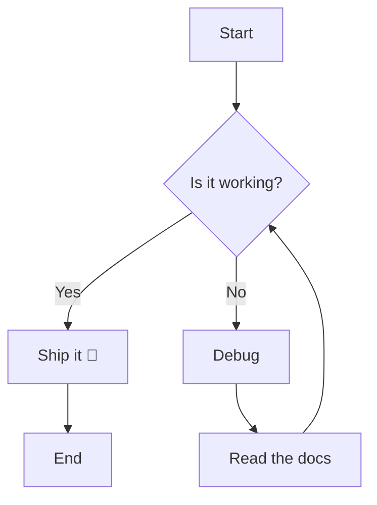

### Sequence diagram

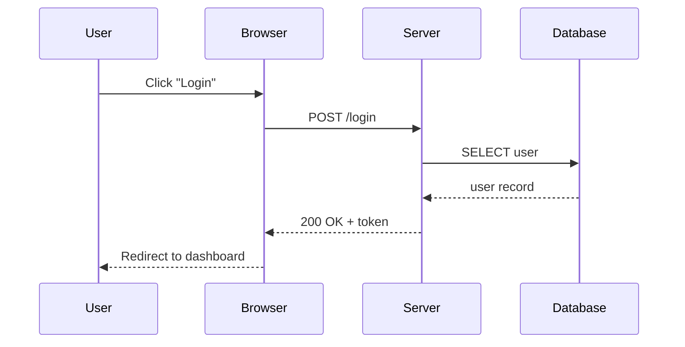

### Class diagram

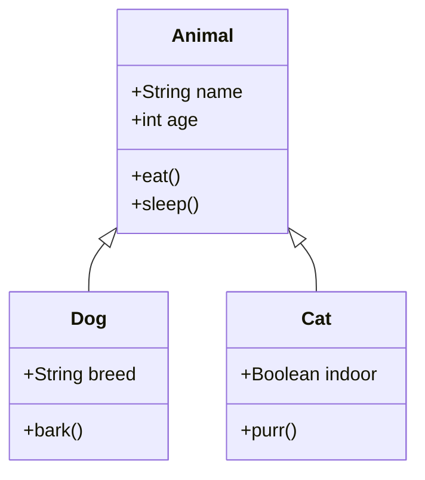

### State diagram

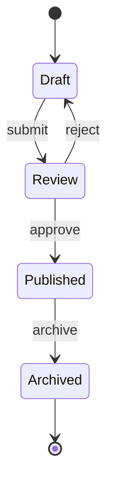

### Gantt chart

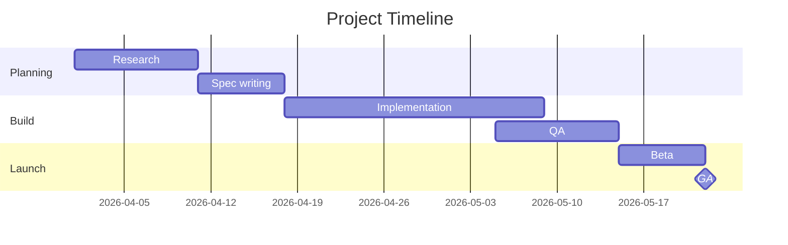

### Pie chart

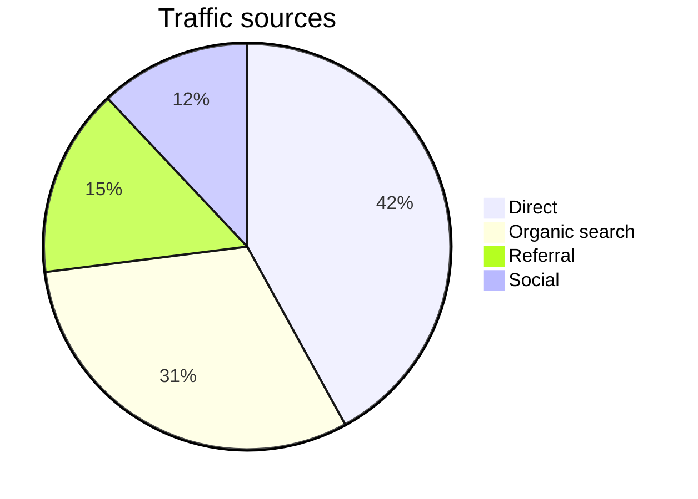

### Entity-relationship

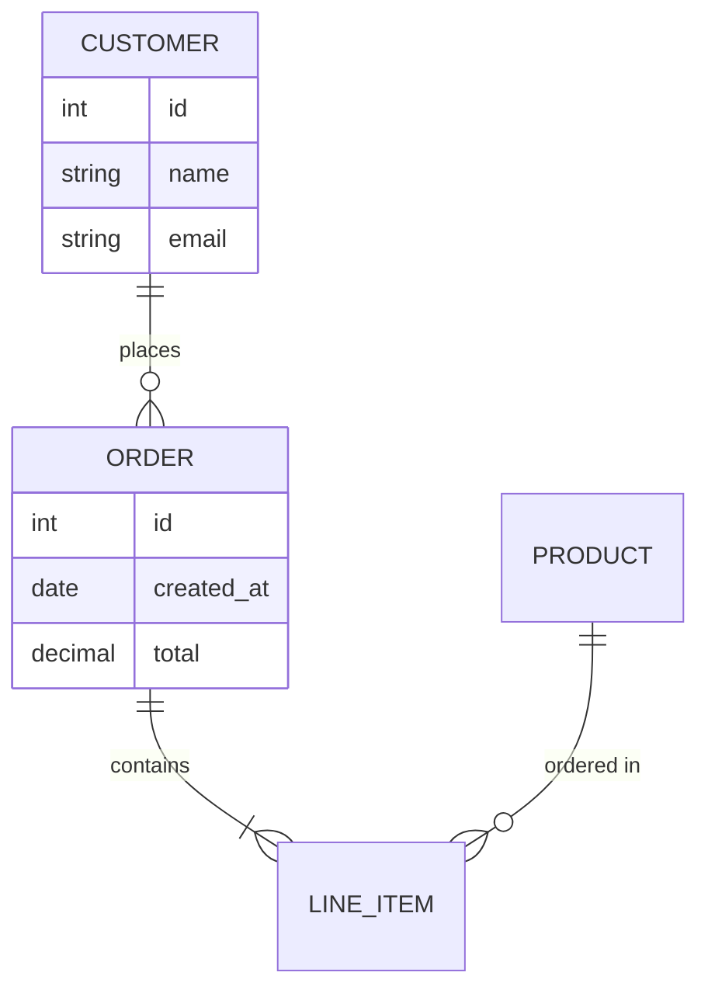

### Mindmap

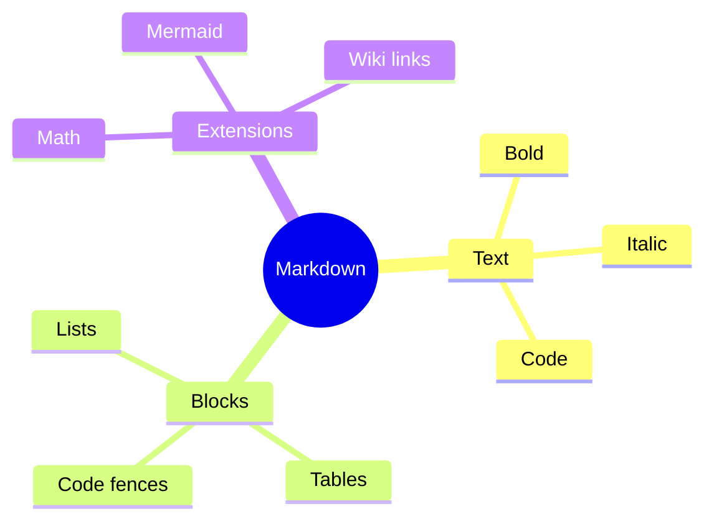

### Timeline

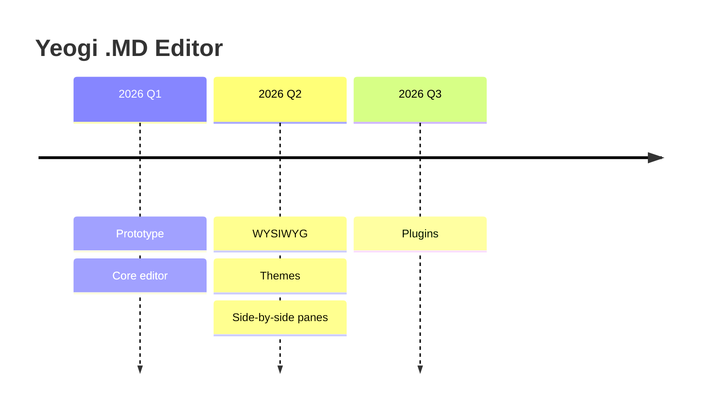

### User journey

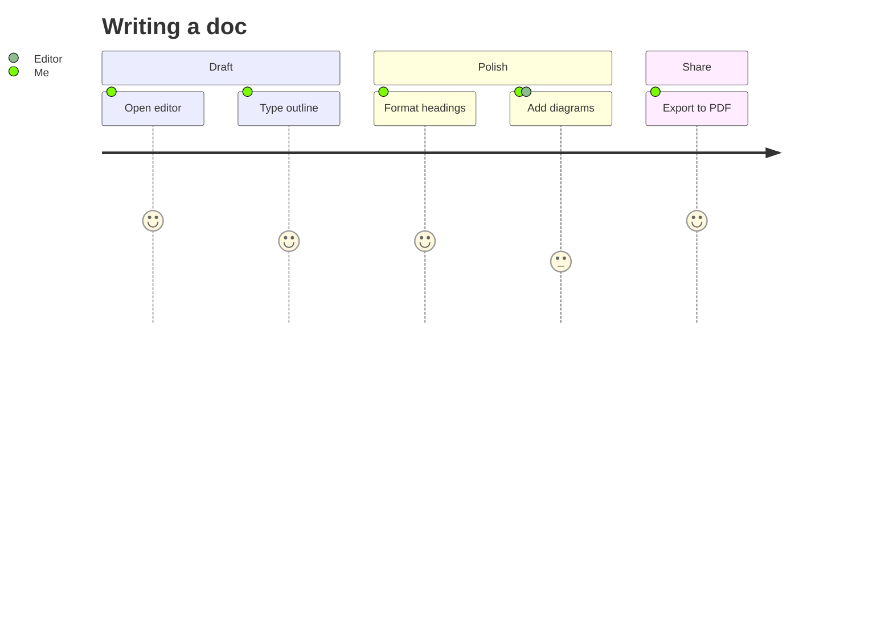

### Quadrant chart

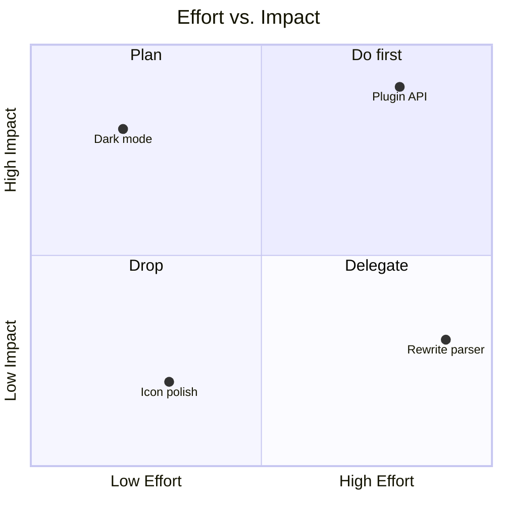

### Git graph

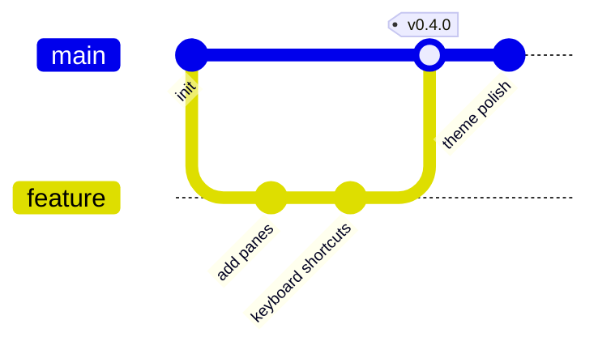

---

## 11. Callouts / admonitions (GitHub + Obsidian style)

> \[!NOTE\] Useful information that users should know.

> \[!TIP\] Helpful advice for doing things better.

> \[!IMPORTANT\] Key information users need to know.

> \[!WARNING\] Urgent info that needs immediate attention.

> \[!CAUTION\] Advises about risks or negative outcomes.

---

## 12. Bracketed text variants

- Plain brackets: `[just brackets]` → \[just brackets\]
- Link form: `[label](url)` → [label](https://example.com)
- Reference: `[label][ref]` → [label](https://spec.commonmark.org/ "CommonMark Specification")
- Wiki: `[[Page Name]]` → [[Page Name]]
- Wiki with alias: `[[Page Name|alias]]` → [[Page Name|alias]]
- Footnote: `[^id]` → [^1^](#fn-1)
- Task: `- [ ]` and `- [x]`
- Callout header: `> [!NOTE]`
- Shortcode/keyboard: Ctrl + C, ⌘S

---

## 13. Horizontal rules

Three or more hyphens:

---

Asterisks:

---

Underscores:

---

---

## 14. HTML embeds and raw HTML

<details>
<summary>Click to expand</summary>

Hidden content with **Markdown** still rendered (in most flavors).

```js
console.log("surprise!");
```

</details>

^superscript^ and ~subscript~ via HTML.

==HTML mark tag==

HTML comments are invisible in rendered output:

Raw table via HTML:

| Col A | Col B |
| --- | --- |
| 1 | 2 |

Abbreviation-style via `<abbr>`: The HTML spec.

---

## 15. Emoji and special characters

Shortcode style (GFM): :rocket: :tada: :+1: :warning: :heart:

Unicode direct: 🚀 🎉 👍 ⚠️ ❤️ 한국어 日本語 中文 العربية

Special characters: © ® ™ § ¶ † ‡ • … — – ≈ ≠ ≤ ≥ ± × ÷

Arrows & math: ← → ↑ ↓ ⇐ ⇒ ∞ ∑ ∏ √ ∫ ∂ ∇

---

## 16. Edge cases

- Line with trailing spaces for a break\
  (two spaces at end of previous line)

- A very long line that should wrap naturally in the viewer without breaking any formatting even if it contains `inline code` and [a link](https://example.com) and some **bold** text and *italics* all jammed together into one run-on sentence.

- Mixed content in a list:

  1. Paragraph item.

     Second paragraph of the same item.

     ```python
     print("code inside list")
     ```

     > Blockquote inside a list.

  2. Next item.

- Empty table cell:

  | A | B | C |
  | --- | --- | --- |
  | 1 |  | 3 |

- URL in a list: <https://yeogi.com>

- Inline code containing backticks: `` `single` and ``double` `rendered via double-tick fences.

---

## 17. Front-matter

The top of this file contains a YAML front-matter block. Good editors render it as metadata; plain ones show it as literal text.

---

*End of test file.* If you can read this line cleanly styled, the basics work. Scroll up and check LaTeX, Mermaid, tables, callouts, and footnotes — those are the usual failure points.

\[^\]:

1. This is the first footnote.

2. Footnotes can contain **formatting**, `code`, and multiple paragraphs.

   Indented continuation paragraph.